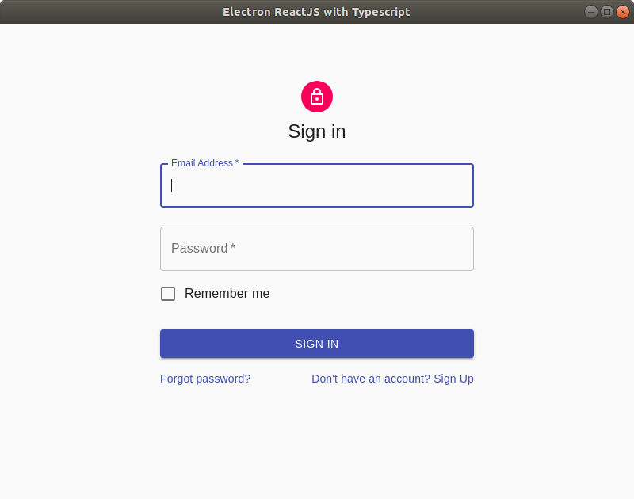

# Electron Template using React and Typescript
This repository is simple template for ElectronJS using React with Typescript. We have implement Material-UI for styles.

<p align="left">
    
</p>

## Getting Started
Clone this repo and run the following commands.
```BASH
npm install
npm run start:electron
```

## How to Build
Run the following command for react build
```BASH
npm run build
```
